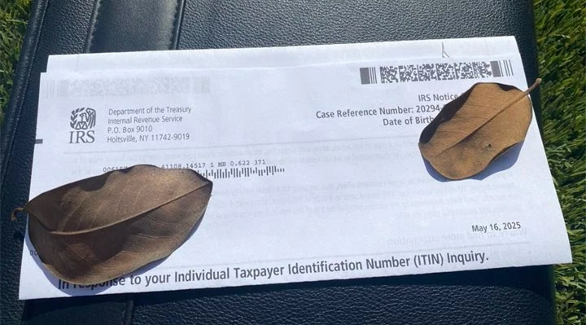
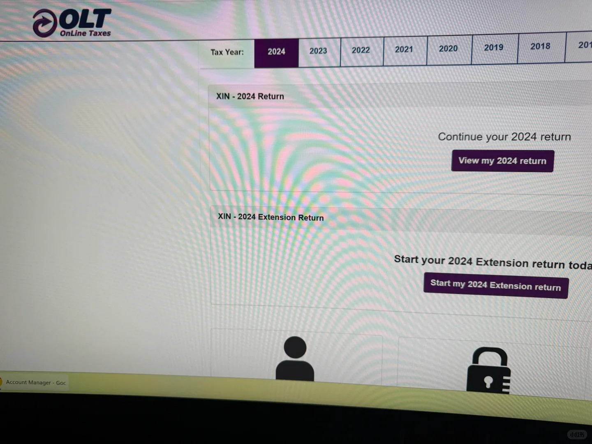
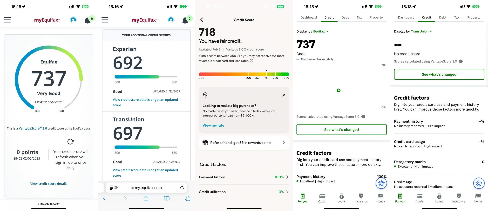
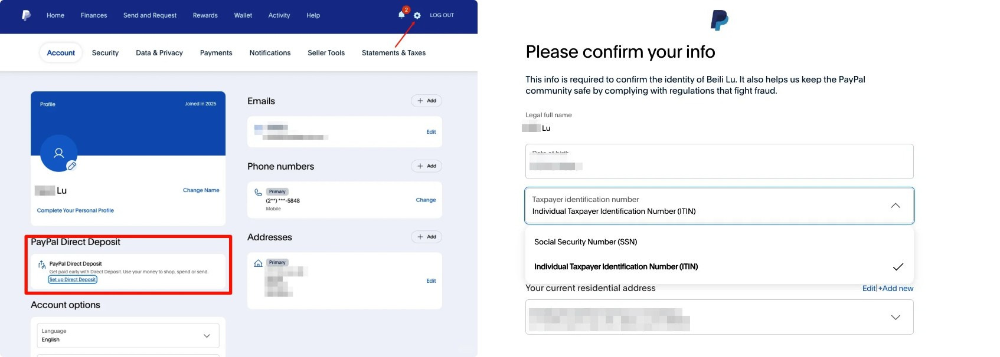

# 在台灣線上申請美國 ITIN 稅號：Form W-7 完整指南

> **快速導覽：** [什麼是 ITIN？](#sec1) · [用途](#sec2) · [DIY 風險](#sec3) · [CAA 代理](#sec4) · [實戰案例](#sec5) · [拿到後注意事項](#sec6) · [報稅指南](#sec7) · [信用分查詢](#sec8) · [PayPal 註冊](#sec9)

---

## 一、什麼是 ITIN 稅號？ {#sec1}

ITIN（Individual Taxpayer Identification Number，個人納稅人識別號碼）是美國國稅局（IRS）發給**無法取得社會安全號碼（SSN）**，但又有**美國稅號需求**的非美國居民（非居民外国人，NRA）所使用的9位數字稅號。ITIN一律以「9」開頭，格式例如：9XX-XX-XXXX。

**沒有 ITIN 能報稅嗎？**對於非居民外國人而言，若在美國有應稅收入（如股息、利息、版權收入等），通常需要報稅或申請退稅；此時就必須先取得 ITIN 才能完成申報。這也是許多人選擇**美國 ITIN 申請**的主要原因。

**誰可以申請美國 ITIN？**

主要適用對象為「需要在美國報稅、但無法取得 SSN 的外國人」，常見包括：

- **非居民外國人（Nonresident Alien）**：如台灣居民，在美國有股息、利息、資本利得、版稅、跨境電商銷售等收入，需申報 1040-NR 或申請退稅。
- **想適用美台稅務協定**：**用美股股息申請 ITIN** 是很常見的場景——透過 ITIN 提交 W-8BEN 表格，可將美股股息預扣稅率從 30% 降至 10%，並申請退回多扣稅款。
- **跨境電商賣家**：在 Amazon、eBay、Etsy、Shopify 等平台銷售，被要求提供美國稅務識別號碼。
- **投資美股或開設美國銀行帳戶**：部分金融機構要求提供稅號以完成身分驗證。

> **重要提醒：**
> - ITIN**不是身分證明文件**，不能用來在美國工作、申請社會福利、駕照或任何移民身分用途。
> - 持有 ITIN**不代表擁有美國居留權或工作權**，純粹是為了符合美國稅法要求。
> - **美國公民或綠卡持有者不符合申請資格**，應使用 SSN 報稅。

---

## 二、申請 ITIN 有什麼用途？ {#sec2}

擁有 ITIN 能幫您打開多扇通往美國金融與商業世界的大門，特別適合有**美國稅號需求**的台灣使用者：

- **合法報稅與退稅：**可將美股股息預扣稅率從30%降到10%，甚至申請退回多扣稅款。
- **開設美國銀行帳戶：**如 Capital One、SoFi、Axos Bank 等接受 ITIN 開戶。
- **申請美國信用卡：**有助於建立美國信用紀錄（Credit History）。
- **解鎖支付平台進階功能：**如 PayPal、Stripe、Shopify Payments 等。
- **投資美股更優惠：**提交 W-8BEN 表格確保享受稅務協定最優惠稅率。
- **跨境電商合規：**滿足 Amazon、eBay 等平台對外國賣家的稅務身分要求。

---

## 三、自己 DIY 線上申請？現實很骨感 {#sec3}

截至2026年，IRS仍不支援完全線上提交 ITIN 申請。所謂「**在台灣線上申請美國 ITIN 稅號**」實際上是：下載 **Form W-7 ITIN 申請**表格、準備資料，最後仍需寄出紙本文件。**Form W-7 ITIN 如何申請（台灣）**？流程包括填寫 W-7、附上護照影本或正本、1040-NR 報稅表等，步驟繁瑣，詳見下文。

**為什麼不建議自己DIY申請ITIN？**主要原因是**時間成本高**與**風險大**：

自行申請需投入大量時間與精力，從填寫 Form W-7 表格、蒐集護照影本、公證文件、填報稅表，到寄送原件、追蹤進度等流程繁瑣冗長。常因格式錯誤（如簽名位置不對、理由勾選不符）或文件不全（缺1042-S股息證明、說明信未附）而被IRS要求補件或整份退回，導致整個流程拖延數月甚至半年以上，成功率不高。

更關鍵的是**風險極高**：DIY必須將護照**正本**寄至美國IRS（或經AIT認證的護照影本，仍需付費約50美元並親自預約）。國際快遞途中易遭遺失、被盜或損壞。一旦發生，不僅要花費數千元新台幣補辦護照、可能需回國處理，還會嚴重影響個人身份安全與後續金融申請（如銀行開戶、信用卡審核）。

一位網友分享：「第一次填錯→重寫…寄出後兩個月收到信說缺資料補件…前後整整拖了快5個月。」這就是DIY最真實的血淚教訓。

---

## 四、推薦方案：找專業 CAA 代理機構申請（代辦 ITIN） {#sec4}

Certified Acceptance Agent（CAA，認證受理代理人）是 IRS 授權的專業機構，若想省時省力完成**美國 ITIN 申請**，**代辦 ITIN** 是較可靠的選擇，優點包括：

- 免寄護照正本（僅需高畫質掃描檔 + 視訊核實）
- 專業處理文件，大幅降低退件風險
- 處理速度較快（平均3–5個月），成功率高
- 提供一條龍服務（如美國地址、報稅諮詢等）

> ⚠️ **揭秘市面上常見的 CAA 違規操作（務必避雷！）**
> - **「幽靈」代簽名（Ghost Signing）：**這是最嚴重的違規！W-7表格必須由申請人**親筆簽名**。很多無良中介直接模仿你的筆跡代簽，等於偽造文書。
> - **「零接觸」辦理：**合規的CAA**一定要視訊面談**核驗護照原件。那些說「傳個掃描件就行」的，不是P圖就是偽造驗證紀錄。
> - **濫用地址（地址掛靠）：**幾百人共用同一個收件地址，在IRS眼中就是典型的「ITIN Mill」（ITIN工廠），極易被列為高風險案件。

> ✅ **如何判斷你的 CAA 是否靠譜？（保姆級防雷指南）**
> - **一定要視訊！** 正規CAA會要求你透過 Zoom / Skype / 微信視訊，當場展示護照原件。
> - **簽名流程透明：** 你應自行列印 W-7 表格並**親自簽名**（濕簽名），再寄給CAA或提供高畫質掃描檔——**CAA絕不能代簽！**
> - **主動詢問資質：** 可直接要求對方出示 IRS 核發的 CAA 授權書（Letter of Acceptance）。
>
> **最後提醒：**代簽名等於留下永久法律風險。IRS現在或許不查，但你的簽名筆跡會永遠留在檔案庫中，成為一顆不定時炸彈。
>
> **正規 CAA 的底線：**必須視訊、必須看護照原件、必須本人濕簽名、絕不代簽！

以下為兩位在 Fiverr 上口碑良好、具備 IRS CAA 資格的美國專業會計師，提供**代辦 ITIN** 及 Form W-7 申請服務，費用透明，最低僅需 **NT$5,600**：

#### Chuhaiji

美國註冊會計師，IRS 認證 CAA，專精華語客戶 ITIN 申請，流程清晰、回覆迅速。

- ✅ 免寄護照正本
- ✅ 提供視訊驗證
- ✅ 含 W-7 + 1040-NR 全套文件

[👉 點此前往 Fiverr 店鋪](https://bit.ly/49XSlfM)

#### Theshstudio

資深 CAA，服務全球非居民客戶，熟悉台灣護照與地址格式，成功率高。

- ✅ 支援中文溝通
- ✅ 平均 3–4 個月完成
- ✅ 提供後續報稅諮詢

[👉 點此前往 Fiverr 店鋪](https://bit.ly/3LSv05Y)

---

## 五、實戰案例分享：拿到 ITIN 後才發現，很多事情遠沒有想像中那麼簡單 {#sec5}

原本以為只要拿到 ITIN，開戶、申請信用卡、綁定帳戶就會順順利利，但實際走過一遭才知道：這條路不只是照著流程走，還有一大堆需要自己反覆試錯、摸索的小細節。

### ① ITIN：拿到號碼只是第一步

我的 ITIN 是 900 開頭，整個申請過程大約花了 8 週左右。IRS 用平信寄出，完全沒有追蹤號碼，全程就是「安心等」。收到號碼當下當然很興奮，但馬上就發現一個很現實的問題——很多金融平台在剛拿到號碼的頭幾週，系統根本還認不出你的 ITIN，尤其是在開戶或身分驗證階段特別容易被卡住。

後來我才摸索出一個時間規律：**ITIN 下號後，通常需要再等 2～4 週，IRS 才會把資料同步到各大金融機構的系統。**太早拿號就急著去申請，反而比較容易被系統打槍。

### ② Checking 帳戶：SoFi 驗證是第一個大關卡

我第一個開的 Checking 帳戶是 SoFi。註冊時使用 ITIN + 護照送件，第一次直接被系統退回，提示「Patriot Act 未通過」。

後來我重新整理資料：
- 重新拍攝護照（要用清晰原圖，千萬不要截圖或壓縮過的版本）
- 把填寫的地址改成跟當初申請 ITIN 時**完全一模一樣**的版本

這樣調整後，兩天就順利通過審核。

📌 **小提醒幾個關鍵點：**
- 地址、電話號碼、護照資訊務必要完全一致
- 上傳文件一定要用清晰的 PDF 或原圖（解析度要夠）
- 通過後可以直接順便開 Saving 帳戶，之後綁定 PayPal 也都很正常

### ③ Capital One 成為我的第一張信用卡

Checking 跑通之後，我就開始申請信用卡。我第一張選的是 Capital One，因為它對 ITIN 算是相對友善。

申請過程如下：
- 9/10 第一次 pre-approve → 沒過
- 9/17 第二次提交，把地址與電話資訊再做匹配調整 → 通過
- 9/25 收到「Say Hello」歡迎信，額度 $500
- 10/12 透過轉運順利收到實體卡

激活時需要做語音驗證，系統會要求輸入 ITIN 後四碼，整個流程大約 2 分鐘左右。激活完成後我直接綁定 Apple Pay，測試付款完全沒問題。

### ④ 電話驗證的幾個小訣竅

不管是 SoFi 還是 Capital One，只要進入人工或語音驗證階段，全部都是英文對話。

我自己的經驗是：
- 盡量使用固定的 IP 環境登入（不要一直跳來跳去）
- 如果英文不夠流利，建議事先把常問的問題寫下來（生日、地址、護照發行地等）
- 千萬不要頻繁切換手機/電腦或開 VPN，否則很容易被系統判定為異常，要求重新驗證

這些看起來很細的動作，其實對系統的風控判斷影響非常大。  
**核心邏輯只有兩個字：穩定 + 一致**

### ⑤ 整體心得總結

- **一致性是王道**：地址、電話、文件、IP 環境，能統一就盡量統一
- 建議先把 Checking 帳戶跑通，再來挑戰信用卡，起步會順很多
- 前期多花一點時間把基本資料對齊好，後面反而省事

拿到 ITIN 只是一個起點，真正考驗耐心和細心的部分，才剛剛開始。希望這些經驗能幫到正在摸索的你～

---

## 六、拿到 ITIN 後千萬別忘了這幾件事！🔥 血淚教訓分享 {#sec6}

姐妹們～終於申請到 ITIN 了是不是超級開心？🥳 但千萬別以為這樣就萬事 OK 啦！拿到 ITIN 之後，這幾件事一定要記得處理，不然真的會踩雷後悔莫及啊～👇

> ✅ **報稅！報稅！報稅！**
> 重要的事說三遍！📣
> 就算你不住在美國，只要有美國來源收入（像是房租、投資配息、股利等），通通都要用 ITIN 報稅喔！
> *小提醒：找一位靠譜的會計師或稅務專家幫忙，比較不會出包～*

> ✅ **把 ITIN 號碼保管好！**
> ITIN 就是你的稅務身分證，絕對不能外洩！🔐
> *建議抄在小本本，或存在有密碼保護的筆電／手機備忘錄裡；千萬不要隨便告訴別人，小心身分被盜用！*

> ✅ **定期查看 IRS 寄來的信件！**
> IRS 偶爾會寄重要通知給你，例如稅務提醒、ITIN 更新要求等。📬
> *務必確認你給 IRS 的地址是正確且最新的；如果搬家或換地址了，記得趕快更新！*

> ⚠️ **ITIN 是會過期的！**
> ITIN 不是永久有效的！如果連續 3 個稅務年度都沒有用來報稅，ITIN 就會在第 3 年底（12/31）到期失效～⏰
> *盡量每年都用 ITIN 報稅（哪怕是零申報也可以）；一旦過期要重新申請超級麻煩又花時間！*

> 💡 **有機會的話，考慮申請 SSN**
> 如果你未來打算長期留在美國工作、生活，SSN（社會安全號）會比 ITIN 方便太多！
> *找到合法工作、有工作簽證後，就可以申請 SSN 來取代 ITIN；SSN 用途更廣，開戶、信用紀錄都更順暢～*

---

## 七、ITIN 玩家報稅基本重點：美股投資與稅務實務指南 {#sec7}

**沒有 ITIN 能報稅嗎？**若尚未取得 ITIN，須先完成申請才能申報美國來源收入。**雲玩家炒股券商需不需要報稅？**

像 IBKR（盈透證券）和 Schwab（嘉信理財）這種國際券商，通常都會自動幫你填好 W-8BEN 表格（非美國居民稅務證明）。外國人享有稅務豁免，券商會自動扣繳該扣的稅（主要是股息部分），你自己基本上不用額外報稅。超方便！

**如果你玩只服務美國公民的券商（如 Fidelity、Webull），要怎麼報稅？**

如果你有填寫 ITIN 或 SSN，但已正確提交 W-8BEN，正常情況下券商**不會發 1099-B 稅表**給你，也就不用像美國稅務居民（RA）那樣繳資本利得稅。

但如果填了 ITIN/SSN 卻**沒提交 W-8BEN**，很可能會收到稅表。別慌！你依然可以按**非居民外國人（NRA）**身份申報。只要你如實填報，IRS 通常不會有問題。

⚠️ 目前尚未有因申報 NRA 身份而被券商關戶的實際案例，但理論上有風險，建議保留所有交易與身份證明文件。

**NRA 炒股要怎麼報稅？**

券商發的稅表主要有兩種：
- **1099-B**：股票交易的資本利得（價差收益）
- **1099-DIV**：股息收入（台灣常說的分紅）

根據中美稅務協定：
- 資本利得（1099-B）→ **需申報，但稅率為 0%**，不用真的繳稅。
- 股息收入（1099-DIV）→ **必須報稅，稅率 10%**（NRA 只需繳這 10%）。

> **小技巧補充（進階版）：**
> 像 Fidelity 的 SPAXX（類似美版餘額寶的貨幣基金），雖然看起來像利息，但券商會開 1099-DIV 而非 1099-INT，因此預扣 10% 稅，很多人覺得很痛。
> 但根據美國稅法，**美國政府債券利息對 NRA 是免稅的**（portfolio interest exemption）。SPAXX 投資組合中大部分為美國國債，理論上可主張大部分收入免稅，僅就真正股息部分繳稅。
> 實際稅額可能只剩 1099-DIV 金額的 10% × 10% 左右（超級划算！），但需自行研究或諮詢稅務專業人士確認。

**銀行利息與開戶獎勵（1099-INT）要不要報稅？**

答案：可以報，也可以不報，看你的情況。

✅ **建議報的原因：**ITIN 若連續三年無報稅紀錄，IRS 可能回收號碼。為保住 ITIN，許多人會用 OLT 或線上報稅工具，將 1099-INT 填入，選擇 NEC（Not Effectively Connected），稅率 0%，申報 1 美元即可維持有效狀態。

✅ **可以不報的原因：**如果你當年已有其他必報項目（如 1099-DIV 股息），這些小額 1099-INT（尤其金額小於 $10）通常可忽略，IRS 不會特別追查。

**總結：**ITIN 玩家報稅的重點其實不在「繳多少稅」，而在「**保住身分**」與「**正確分類收入性質**」。有大額股息或複雜情況時，建議搭配 Sprintax 或專業稅務顧問處理，比較保險～

---

## 八、使用 ITIN 查詢美國信用分的實用途徑（2026 年最新實測） {#sec8}

以下方法特別適合沒有 SSN、僅持有 ITIN 的朋友。目前 **Equifax** 仍是線上最容易取得的信用局，TransUnion 和 Experian 相對困難，所有分數皆採用 **VantageScore 3.0** 模型計算。

**✅ Equifax 官方管道（最友善）**

第一種方式：當你持有 **Capital One 信用卡** 並至少有一期正常帳單後，直接到 Capital One 網站註冊 **CreditWise** 或相關免費信用監控服務，完全不用聯絡客服就能成功註冊，立即看到 Equifax 的信用分數與簡易信用報告，非常方便。

第二種方式：先註冊 **myEquifax 免費帳戶**，之後通常會收到一封 email，提供 **1 美元試用 Equifax Complete Premier 一個月** 的連結。透過這個試用可以一次查看三個信用局（Equifax、Experian、TransUnion）的信用分數與詳細信用報告。  
🔍 *實測發現這個 1 美元試用可以多次重複使用（例如隔幾個月再註冊新 email），看完記得取消以避免自動扣款。*

**📌 更新頻率提醒：**
- Equifax 免費版：每月更新一次
- Equifax 付費版：每日更新
- Experian / TransUnion：每次付費才更新，或每年有一次免費更新機會

**✅ SoFi（穩定追蹤 TransUnion）**

只要註冊 SoFi 帳戶，就能在 App 或網頁直接查看 **TransUnion 的信用分數**，更新速度非常即時，幾乎是 real-time。這對特別想追蹤 TransUnion 分數的 ITIN 使用者來說是目前相對容易的選擇，註冊過程也順利。

**✅ Credit Karma（近期突破）**

過去不太接受 ITIN，但從 **2025 年底到 2026 年初** 開始，當你輸入後四位無法辨識時，系統會自動要求輸入**完整 ITIN**，這時填入完整號碼就能成功註冊（建議全程使用美國 IP 會更順暢）。

註冊成功後，App 可查看 **Equifax 的信用分數與報告**，更新頻率高。雖然介面也會顯示 TransUnion，但 ITIN 使用者通常無法看到完整內容，會呈現空白或受限狀態。

> **💡 2026 年最推薦組合策略：**
> - 用 **Capital One** 每月免費查看 Equifax 分數
> - 收到 **Equifax 1 美元試用信** 時，一次看三局詳細報告
> - 用 **SoFi** 穩定追蹤 TransUnion 分數
> - 把 **Credit Karma** 當作 Equifax 的輔助監控工具
>
> 以上方法皆於 2026 年初實測有效，但信用局政策隨時可能調整，建議註冊時使用美國 IP，並保留相關畫面備份。有新發現會再更新。

---

## 九、使用 ITIN 註冊美國區 PayPal 帳號並申請實體卡 {#sec9}

許多雲居民在取得 ITIN 後，都想進一步解鎖美國區 PayPal 的完整功能，尤其是申請 PayPal 實體卡（PayPal Cashback Mastercard®）並綁定 Apple Pay 或 Google Pay。

這裡分享一個關鍵實測經驗：

PayPal App 內**無法直接輸入 ITIN**，只提供 SSN 欄位，導致許多使用者誤以為 ITIN 無法使用。但實際上，**正確做法是透過電腦瀏覽器登入 PayPal 官網**（paypal.com），在「帳戶設定」→「稅務資訊」中手動填入完整的 ITIN 號碼。

填寫完成並成功驗證後，回到 PayPal App，原本隱藏的「申請實體卡」選項就會自動出現！

一位使用者實測：「剛下好 ITIN，歐區 PayPal 幾乎半殘，轉戰美區後，官網填完 ITIN，App 立刻跳出實體卡申請入口，現在已順利綁定 Apple Pay，實體卡也寄到美國地址！」

> **📌 操作提醒：**
> - 務必使用**美國 IP** 登入 PayPal 官網操作
> - 帳戶地址需與 ITIN 申請時一致
> - 實體卡寄送地址建議使用穩定的美國住宅地址（非 PMB）
> - 首次使用可能需完成身份驗證（如上傳護照）

---

*ITIN 是連結美國金融體系的重要橋樑。選對專業代理，並做好合規維護，就能安全高效地拓展全球金融版圖。*
